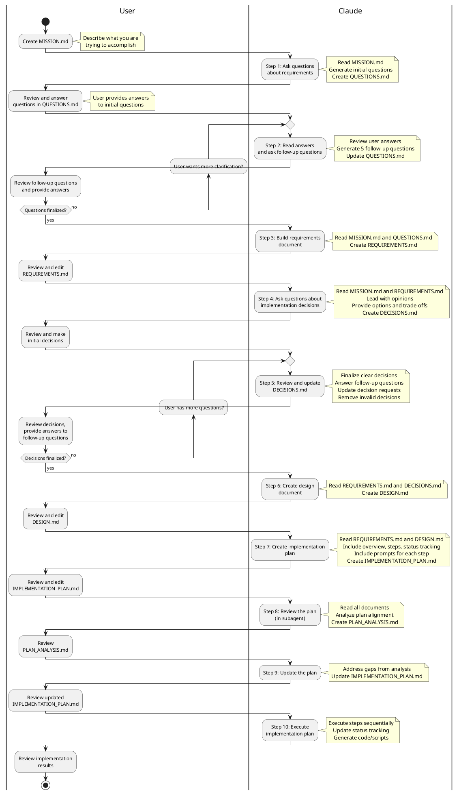

# Naive Approach Workflow

This diagram illustrates the workflow for building scripts with Claude Code using the naive approach documented in PROCESSING.md.

## Key Characteristics

- **User Review Points**: Between each step, the user reviews and potentially edits the generated documents
- **Iterative Steps**: Steps 2 and 5 are designed for review-and-iterate cycles before finalizing
- **Document-Driven**: Each step produces or updates specific documents that inform subsequent steps

## Workflow Diagram

## Process Flow Summary

### Sequential Steps (1, 3, 4, 6, 7, 8, 9, 10)
These steps follow a linear progression where Claude generates a document and the user reviews/edits before proceeding to the next step.

### Iterative Steps (2, 5)
- **Step 2**: Review-and-iterate on requirements questions until all necessary information is gathered
- **Step 5**: Review-and-iterate on implementation decisions until all design choices are finalized

### Documents Created

1. **MISSION.md** - User-created description of what they're trying to accomplish (Initial step)
2. **QUESTIONS.md** - Requirements discovery questions and answers (Steps 1-2)
3. **REQUIREMENTS.md** - Functional requirements document (Step 3)
4. **DECISIONS.md** - Implementation decisions with options and trade-offs (Steps 4-5)
5. **DESIGN.md** - Technical design/architecture document (Step 6)
6. **IMPLEMENTATION_PLAN.md** - Detailed implementation plan with prompts (Steps 7, 9)
7. **PLAN_ANALYSIS.md** - Analysis of plan alignment with requirements (Step 8)

### User Role

Throughout the process, the user:
- Creates the initial MISSION.md describing what they want to accomplish
- Reviews generated documents after each step
- Provides answers to questions
- Makes implementation decisions
- Edits documents as needed before proceeding
- Validates that each step produces the expected output
